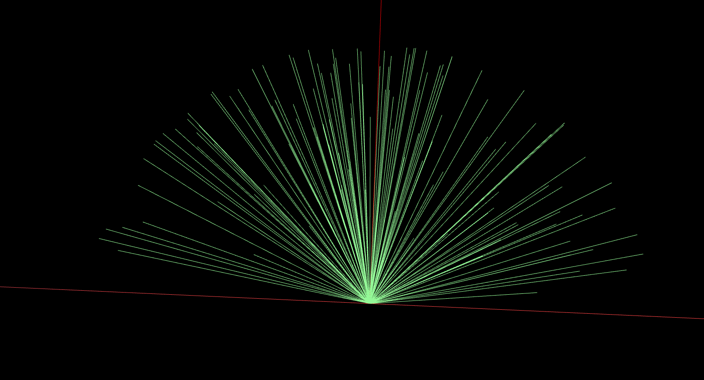
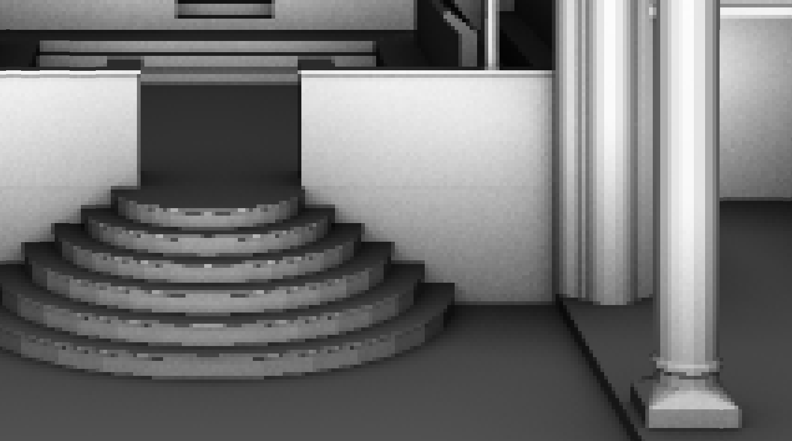
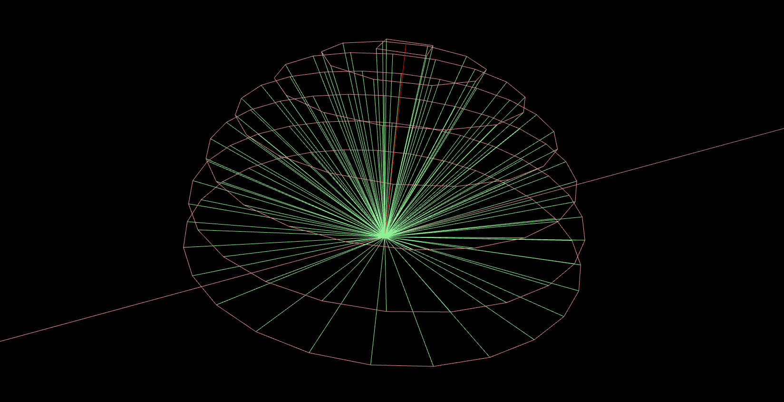
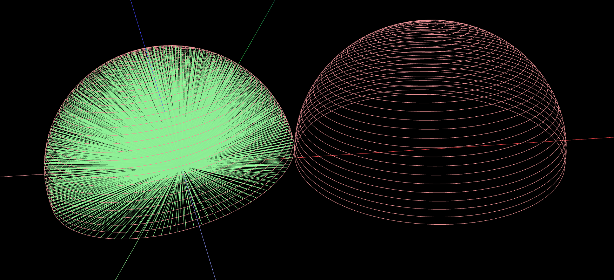
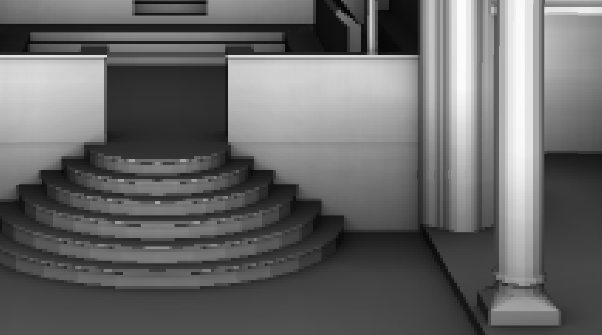

# Why is our renderer so fast?
## About our parallelism
Our implementation is heavily based on OpenCL to ensure that as much computation power as physically possible can be used in parallel to render a scene. As for the realization of _Super Sampling_ (SS), we chose to supersample invidual pixels intead of individual rows or columns, as the corresponding code can be executed by the very same OpenCL kernel that also interects triangles and Bounding Volume Hierarchies for each pixel (see _Embarrassingly Parallel_).

## Surface Area Heuristic
Since the Median Cut method was painfully slow and the Cut Longest Axis method didn't seem to be the fastest of its kind either, we decided to implement the _Surface Area Heuristic_ (SAH) method referenced in an earlier lab. You can switch between these two methods by rewriting the corresponding line in `main.cc` to either of the following options:

```
BVH bvh(BVH::Method::CUT_LONGEST_AXIS);
```
or
```
BVH bvh(BVH::Method::SURFACE_AREA_HEURISTIC);
```
Note that we do not support _Median Cut_ anymore (it didn't seem to have any advantages over any of the other methods whatsoever). By using _Cut Longest Axis_, you will barely need any time to build a usable BVH (your rendering process will take a while, though). We recommend using the SAH method which might take about 10 minutes on a decent computer in order to generate one of the most efficient binary trees that we could possibly traverse when raytracing the image.

## Uniform Hemisphere Scattering
One capital issue with the given renderer was, without any question, that in order to create rays with the provided hemisphere sampler, you were forced to make use of pseudorandom floats to reach an acceptable degree of spherical scattering.

Not only that lots of computation time is repeatedly wasted — the randomization process will generate different results every time you render the scene. Also, we found that hemispheres created by this manner tend to be weighted towards the hemisphere's normal as can be seen in the following illustration.


As for the resuling rasterization, your image may be quite noisy; especially if you choose your Ambient Occlusion (AO) factor to be very small. The noise can be observed quite well on the wall or the pillars within the following Sibenik scene (note the granular structure/pixelation; the count of AO rays is approximately 570).



We enhanced this by implementing an entirely new hemisphere sampler that distributes the rays more equitably. A 3D representation of the hemisphere that is created using our algorithm can be seen in the picture below. You can see that the hemisphere has a fair distribution of rays around itself.

The minimum and maximum angles αmin and αmax between the hemisphere's bottom plane and the resulting ray can be adjusted (see `opts.aoAlphaMin` and `opts.aoAlphaMax` in `main.cc`) to ensure a more realistic light scattering.


The algorithm we developed for creating this hemisphere will be more precise for higher counts of rings. These rings are evenly distributed between αmin and αmax such that lower rings will cast more rays and higher rings will cast less. This is due to the fact that, in a hemisphere, lower rings will always have a greater radius than higher rings (and are thus more important to be considered when casting rays).

There are two possible configurations for the parameter `opts.aoMethod`:
```
RayTracer::AO_METHOD_UNIFORM
```
or
```
RayTracer::AO_METHOD_RANDOM
```
If you choose to set it to `RayTracer::AO_METHOD_UNIFORM`, a Uniform Hemisphere will be created (this is generally faster and more precise). You can also use `RayTracer::AO_METHOD_RANDOM` which will create a randomized hemisphere, just in case you'd like to measure the difference.

Please beware that with Uniform Hemispheres enabled, the exemplary option
```
opts.aoNumSamples = 15;
```
changes its meaning and behavior. Now, instead of casting 15 rays per hemisphere (which is the default behavior for `RayTracer::AO_METHOD_RANDOM`), your Uniform Hemisphere will contain 15 layers of rings that will contain an enormous amount of rays (here: approximately 570 rays for 15 rings). When comparing this renderer to other renderers, please make sure that both cast an equal amount of rays (don't panic, we'll print the the amount of rays and circles for you when you use this option).

Needless to say, every ring casts the rays in multiple angles of θ (with θ being individual for every ring but equal within the same ring). Higher adjustments for the number of rings (`aoNumSamples`) will generate astonishingly accurate hemispheres. The following image shows a hemisphere (with and without the corresponding rays) created with a ring count of 'only' 30 layers.



Doing this, the overall speed is dramatically enhanced: No more pseudorandomness, but precise and incredibly fast scattering granting an enormous level of fast AO. This makes our renderer able to get better results in less time, as you can see in the picture below. The rendering options were the same as in the picture above (but with the new hemisphere sampler instead, using only 15 circles which approximately results in 570 rays).


The noise artifacts on the walls and pillars were removed and their surfaces' color bands appear a lot smoother – on further inspection you will as well notice that now, shadows are cast more realistically (individually compare the bottom left corner of the rightmost pillar, for instance).

## Notes
Tested hardware/software

Device                                                    | Execution                                | OS               | Works
----------------------------------------------------------|------------------------------------------| -----------------|------
Intel(R) Core(TM) i5-3317U CPU @ 1.70 GHz                 | OpenCL 1.2 LINUX - Intel(R) OpenCL       | Arch Linux       | Yes
Intel(R) Core(TM) i5-2500K CPU @ 3.30GHz                  | OpenCL 1.2 LINUX - Intel(R) OpenCL       | Arch Linux       | Yes
AMD Phenom II X4 965 BE CPU @ 3.40 GHz                    | OpenCL 1.2 LINUX - AMDAPP SDK OpenCL     | Arch Linux       | Yes
Nvidia GeForce GTX 650, Kepler GPU                        | OpenCL 1.1 CUDA 4.2.1 - NVIDIA CUDA      | Ubuntu 12.04 LTS | Yes
Intel(R) Core(TM) i7-3770 CPU @ 3.40GHz                   | OpenMP                                   | Ubuntu 12.04 LTS | Yes
Intel(R) Atom(TM) CPU N270 @ 1.60GHz - ASUS Eee PC 1001HA | OpenMP                                   | Arch Linux	  | Yes
Nvidia GeForce GTX 650, Kepler GPU, ASUS P8P67 EVO        | OpenCL, might be a graphics driver issue | Arch Linux       | No

## Caveats
When rendering an image, you might notice that the parameters `WIDTH` and `HEIGHT` seem to be off (at least that's what your terminal tells you). This is due to the fact that, instead of implementing a complex algorithm for Supersampling, we decided to just render the image with higher virtual dimensions and then scaling it down to the dimensions you've requested (if you think about it, this is 100% equivalent to Supersampling. This means that for `WIDTH` and `HEIGHT`, we will always show you virtual dimensions, but the resulting picture will have the dimensions that you've specified in `main.cc`.